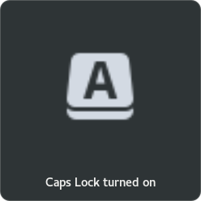

# gnome-shell-extension-LockKeysOSD

Shows <kbd>CapsLock</kbd>, <kbd>ScrollLock</kbd> and <kbd>NumLock</kbd> as popups.
Looks like the volume and brightness popup.

If your icon theme doesn't have a caps/num/scroll lock icon:
In settings, you can use either a GTK Icon name, or a file name

Screenshot with Papirus Icon theme and Adwaita Shell theme.


Tested Working on Gnome Shell 3.26, 3.28, 3.30. May work for others.

## Installation

* Copy lock-keys-osd@n07ftw.github.com to the ```~/.local/share/gnome-shell/extensions/ ```
* Enable in gnome-tweak-tool, in browser extensions.gnome.org, in dconf, or wherever.
* No extensions.gnome.org extension yet!

For status panel: [keysindicator@caasiu.github.com](https://github.com/caasiu/gnome-shell-extension-KeysIndicator)
